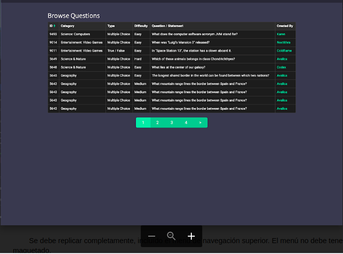
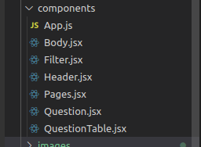
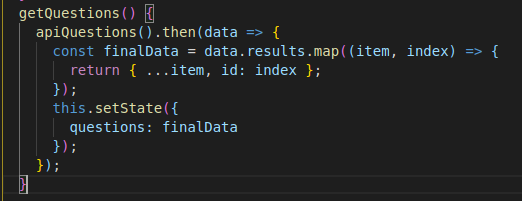

# ChallengeFintonic
This in my solution to the technical challenge that you asked for.

The example provided:

## HOW TO USE IT?:

1. Create React App
2. Install npm and run npm install and then start in the terminal.
2. Install, Fontawesome and Sass.

#### FIRST STEP: CREATE COMPONENTS.
I have divided the code into small reusable components that make it easier to read and understand.
Below, you will find the image with the component structure:

#### SECOND STEP: STYLE COMPONENTS.

I use preprocessor SASS to style layouts, colors and fonts.

#### THIRD STEP: FIRST BONUS.

Get de Data from The Open Trivia Database a free JSON API: https://opentdb.com/api_config.php.
I fetch the data and stored in the "questions" state.
The data came without ID so I use a function to add the ID to the data. 

#### FOURTH STEP: SECOND BONUS.

Create inputs to filter the questions. I dicided to create three inputs to filter the data. You can filter by type of questios, difficulty or category.

Thank you for your time.